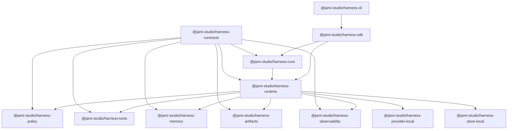

Harness is organized as a contract-first core surrounded by replaceable capability modules behind explicit ports. The owned core defines product grammar; adapters translate local or vendor behavior into Harness contracts.

## Capability classes

Every Harness surface falls into one of four classes:

- **Core invariants** — contracts, runtime lifecycle, policy seam, tool wrapper, artifact/evidence model, and observability event contract.
- **Included defaults** — local store, default memory, default context assembler, default policy engine, common provider/tool adapters, CLI, and SDK helpers.
- **Replaceable modules** — memory, context, providers, policy engine, artifact storage, trace/audit/metric sinks, secret resolver, hosted store, docs publishing output, and workbench shell.
- **Optional surfaces** — hosted dashboard, docs site, advanced eval packs, marketplace catalogs, SaaS control plane, cloud recipes, and Studio UI-powered workbench.

## Package graph

## Adapter ports

Replaceable modules sit behind stable ports. Replacement stays behind the default-deny policy seam and audit evidence requirements.

| Port | Default | Replacement boundary |
| --- | --- | --- |
| BYO memory/context/search | local in-process \+ memory-backed | hosted/vector retrieval unavailable |
| BYO checkpoint store | in-memory and filesystem | hosted stores unavailable |
| BYO provider | `@jami-studio/harness-provider-local` deterministic | hosted providers fail closed |
| BYO policy engine | default-deny seam | replacement must preserve audit evidence |
| BYO tools | function tools \+ trusted MCP fixtures | broader protocol/local adapters fail closed |
| BYO artifacts \+ observability | local stores/sinks | hosted backends unavailable |
| BYO docs output | `pnpm docs:generate` | SDK docs-output injection unavailable |

## Composable primitive registry

The harness-owned catalog of run, tool, policy, artifact, memory, and docs primitives is the **composable primitive registry**. Each primitive defines:

- id and version
- owner package
- input and output schema
- policy requirements
- audit event shape
- trace span shape
- docs generation metadata
- verification requirements
- adapter compatibility

The machine-readable vocabulary lives in `packages/contracts/schemas/primitive-manifest.schema.json`. Capability modules and adapters declare supported features, unsupported states, required scopes, failure modes, and replacement compatibility through `packages/contracts/schemas/capability-manifest.schema.json`.

## Boundary rules

- Core packages define Harness grammar and lifecycle.
- Capability packages own behavior behind explicit ports.
- Adapter packages translate local or vendor behavior into Harness contracts.
- UI packages display Harness state but do not execute actions or policy decisions.

<Warning>
  Do not move policy execution, tool invocation, memory writes, or trace ownership into registry items or Studio UI components. Those surfaces can display Harness refs, but the Harness remains the execution owner.
</Warning>