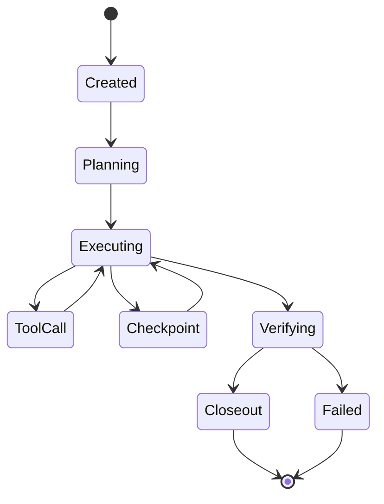

The agent runtime owns the run lifecycle. Every run carries a durable id, an actor/project/environment context, and a contract-validated event stream from start to closeout.

## Lifecycle stages

## Core concepts

- **Run** — the top-level durable unit. Carries actor, project, environment, and policy context.
- **Session** — a multi-run context binding for related work.
- **Task** — a unit of work inside a run, with its own retry and recovery state.
- **Turn** — a single provider/tool exchange inside a task.
- **Handoff** — a transfer between coordinator and worker passes.

## Contracts

Run lifecycle events conform to the schemas in `@jami-studio/harness-contracts`:

- `runEvent` — typed lifecycle events.
- `actionRef` — stable reference to an executed action.
- `toolExecution` — typed tool call records.
- `policyDecision` — decisions emitted by the policy seam.
- `artifactRecord` — outputs produced during the run.
- `traceEvent` and `auditEvent` — observability and audit records.
- `evidencePacket` — the final bundle the run produces.

See [Contracts overview](/harness/contracts/overview) for the full schema map.